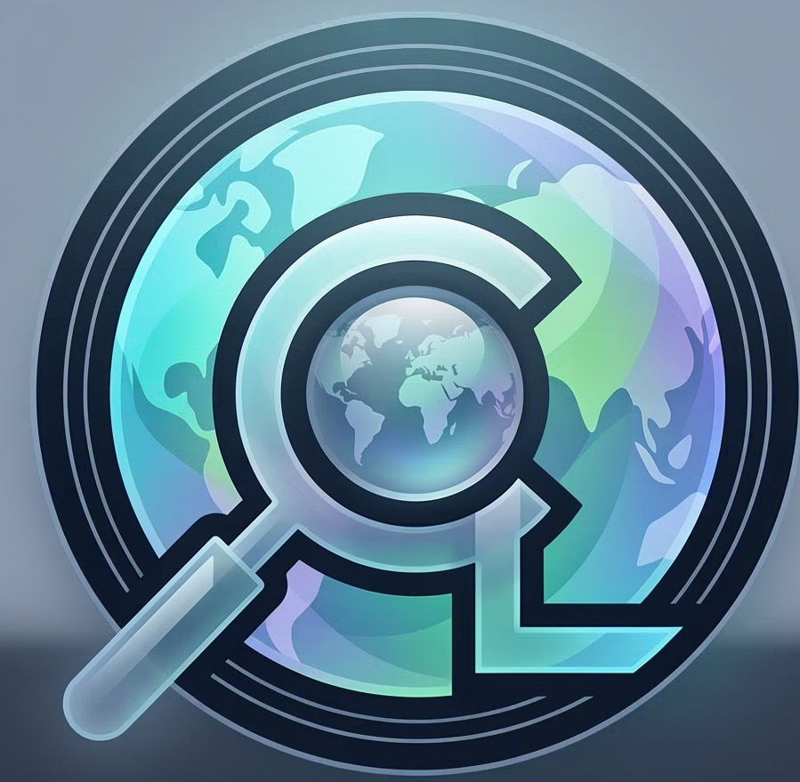
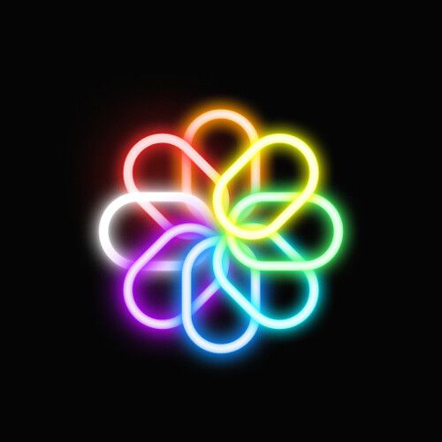

<!-- PROFILE README -->

  
   
  Above art is made using Gemini.

 

  

### 👨‍💻 More About Me

- 🧑‍🎓&nbsp; Software Engineer and Developer  
- 👉&nbsp; Currently building and learning **System Design**  
- 🧿&nbsp; Focused on scalable and real-world applications  
- 🤓&nbsp; Interested in **Machine Learning and Backend Systems**  
- 🔭 &nbsp; I’m currently working on **[CultureLens](https://github.com/nikhilagarwal03/CultureLens)**
- 📝 &nbsp; Checkout my [resume]()
- 👨🏻‍💻 &nbsp; Most of my projects are available on [Github](https://github.com/nikhilagarwal03?tab=repositories)
- 📫 &nbsp; Feel free to ping me on [LinkedIn](https://www.linkedin.com/in/nikhilagaarwal/)
- ♟️ &nbsp; I sometimes play [Chess](https://www.chess.com) during my free time.
- 🤝 &nbsp; Open to collaborations 
- 🤠 &nbsp; Check out my [Linktree](https://linktr.ee/nikhilagaarwal)
- 🤜 &nbsp; Connect with me on [X/Twittter](https://x.com/nikhillhere), [LinkedIn](https://linkedin.com/in/nikhilagaarwal)

 

### 🛠 Languages & Tools

  

 

### 🚀 Projects

<table align="center" cellspacing="20">
<tr>

<td align="center" width="260">
  <a href="https://github.com/nikhilagarwal03/CultureLens">
      
    <b>CultureLens</b>
  </a>
   
  AI-powered cultural interpreter
    
  <a href="https://github.com/nikhilagarwal03/CultureLens">Code</a> • 
  <a href="https://culturelensai.vercel.app">Live</a>
</td>

<td align="center" width="260">
  <a href="https://github.com/nikhilagarwal03/Malware-Analysis-Using-ML">
    <b>Malware Detection ML</b>
  </a>
   
  Identifies malicious files using ML models
    
  <a href="https://github.com/nikhilagarwal03/Malware-Analysis-Using-ML">Code</a> • 
  <a href="https://malware-analysis-project.streamlit.app">Live</a>
</td>

<td align="center" width="260">
  <a href="https://github.com/nikhilagarwal03/Click-n-Color-Chrome-Extension">
    
    <b>Click n Color</b>
  </a>
   
  Chrome extension for quick color picking
    
  <a href="https://github.com/nikhilagarwal03/Click-n-Color-Chrome-Extension">Code</a>
</td>

</tr>
</table>

### ✍️ Blogs

📝 [Visit My Medium Page](https://medium.com/@agarwalnikhil909)

- [My Blog on Building CultureLens](https://medium.com/@agarwalnikhil909/the-internet-is-global-but-culture-isnt-building-culturelens-016daef78f68)

- [My Blog on Perspective](https://medium.com/@agarwalnikhil909/perspective-the-other-side-of-the-same-story-cb7bbd53c194)
